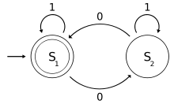

# FsmGenerator
FsmGenerator is a simple to use Finite State Machine generator for C. It takes care of the boilerplate code of states and transitions, and lets you concentrate on your application's logic.

Check out the examples below to get a better idea.
## Why?
Finite State Machines are beautiful creatures, rarely seen in the wild.

While that may not be completely true, it is surprising how useful state machines can be, and how rarely they're used as a central building block of large systems. Weather they maintain the state and state transitions of small entities within an application, or the entire state of an entire system, thinking in terms of states and transitions may simplify the design of many systems.

Have a look at [this great blog post](http://gameprogrammingpatterns.com/state.html) for an excellent example of how state machines can simplify your code and design.


## Features
* Generate a State Machine based on a simple YAML description of the states and transitions.
* Control what happens when entering each state, during input evaluation and upon leaving a state.
* No external dependencies (except for pthreads).
* Memory efficient - multiple instances of the same FSM share common information, keeping in memory only what's actually needed.

### Planned Features
* FSM backtrace
* Asynchronous inputs
* Setting the initial state (currently the first state is always the initial state)
* Machine and State options
* Efficient management of multiple machines
* Support multiple types of inputs:
	* Integers
	* Doubles
	* Strings
	* String patterns
	* Binary blobs
* Final state callbacks
* Control default input behavior
* Chain multiple state machines


## Getting Started

### Building
After cloning the repository, run the following commands to build the project:

```
# create the state machine files
./bin/mr_fsm_gen.py -i examples/simple_fsm.yml -o examples/

mkdir build
cd build
cmake ..
make
```

### Creating a State Machine
Let's create a simple state machine. Here's what it looks like:



We can describe this FSM as a YAML file:

```
name: simple_fsm
states:
        - name: S1
          transitions:
          - 0: S2
          - 1: S1
        - name: S2
          transitions:
          - 0: S1
          - 1: S2
```
Let's auto generate C code for this machine:

```
./bin/mr_fsm_generator.py -i simple_fsm.yml -o <output_directory> -m
```

The `-m` flag generates default implementations for our state steps functions (basically just `printf` the current step). By omitting the `-m` flag we can make the generator generate function skeletons for the user to implement.

4 files have been generated:

```
simple_fsm.ag.h
simple_fsm.ag.c
simple_fsm_states.ag.h
simple_fsm_states.ag.c
```

Let's use the generated machine in an example program:

```
int main(int argc, char **argv) {
    simple_fsm_t fsm;

    simple_fsm_init(&fsm);
    simple_fsm_print(&fsm);

    simple_fsm_start(&fsm);
    simple_fsm_input(&fsm, 0);
    simple_fsm_input(&fsm, 1);
    simple_fsm_input(&fsm, 1);

    simple_fsm_stop(&fsm);
    simple_fsm_destroy(&fsm);
}
```

After compiling and running this program, this is the output we'll get:

```
fsm={ name='simple_fsm' n_states=2
	state={name='S1'}
	state={name='S2'}
}
[INF] starting fsm name='simple_fsm'
[DBG] waiting for fsm to be ready
called function: S1_on_entry
[DBG] FSM READY, STARTING...
called function: S1_exec
called function: S1_on_exit
[DBG] cur_state='S1' input=0 next_state='S2'
called function: S2_on_entry
called function: S2_exec
called function: S2_on_exit
[DBG] cur_state='S2' input=1 next_state='S2'
called function: S2_on_entry
called function: S2_exec
called function: S2_on_exit
[DBG] cur_state='S2' input=1 next_state='S2'
called function: S2_on_entry
called function: S2_exec
called function: S2_on_exit
```

By changing the default implementations in `simple_fsm_states.ag.c` the user can control exactly how the machine behaves, and build complex applications quickly.

## Cool State Machine Examples
TODO

## Notes
* Built and tested on a Mac. Will try it out on Linux soon. No Windows support is planned.
* Codebase is relatively young and not fully tested. **Not yet ready to be used as production code**.

